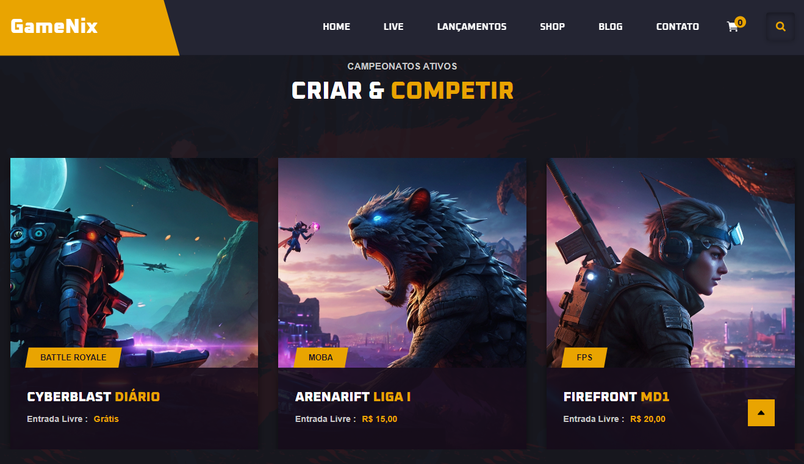
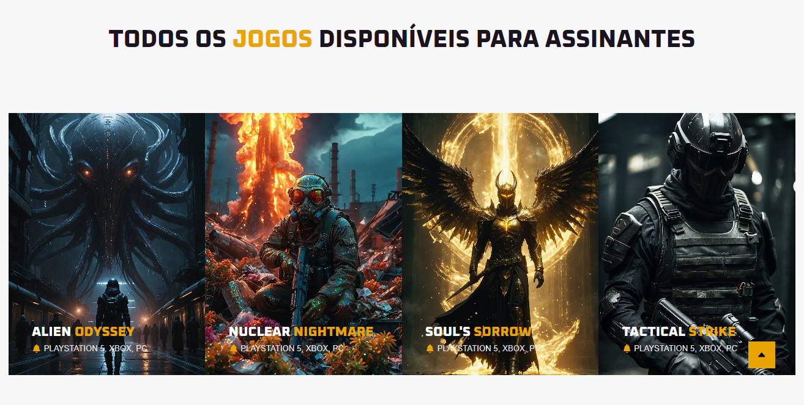
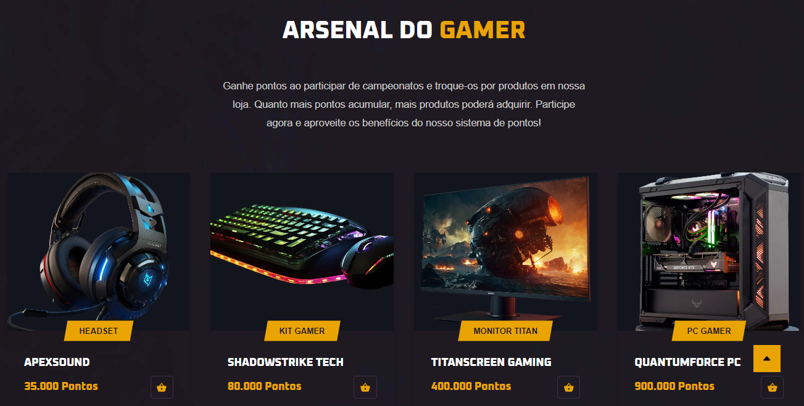

# GameNix - Plataforma para Participação e Acompanhamento de Campeonatos Gamers

## Sobre o Projeto

O **GameNix** foi desenvolvido com o intuito de proporcionar uma experiência imersiva e completa para fãs de eSports. A ideia do projeto é simular uma plataforma onde os jogadores podem participar de campeonatos, acompanhar transmissões ao vivo, conferir os próximos jogos e trocar pontos por produtos exclusivos na loja virtual.

Embora o site seja composto por jogos e competições fictícias, cada detalhe foi pensado para imitar a estrutura de uma plataforma real, fornecendo uma visão aprofundada de como um site desse nicho pode ser construído e apresentar suas funcionalidades.

## Principais Funcionalidades

- **Campeonatos**: Navegue por campeonatos fictícios e explore detalhes de cada equipe e suas performances.
- **Transmissões ao Vivo**: Assista às partidas ao vivo diretamente do seu navegador.
- **Próximos Jogos**: Fique por dentro dos próximos confrontos e equipes que vão disputar.
- **Jogos para Assinantes**: Desbloqueie conteúdo especial e tenha acesso a jogos exclusivos para assinantes.
- **Sistema de Recompensas**: Acumule pontos com suas vitórias e troque por produtos na loja **Arsenal do Gamer**.
- **Notícias e Atualizações**: Leia as últimas novidades e atualizações do universo fictício dos jogos e competições.

Para aprimorar a identidade visual do site, foram utilizadas ferramentas de **inteligência artificial** para gerar imagens e textos promocionais que complementam a experiência do usuário. A IA foi empregada para gerar descrições automáticas e conteúdos fictícios de jogos e campeonatos.

## Tecnologias Utilizadas

- **HTML**: Estruturação do conteúdo e layout das páginas.
- **CSS**: Estilização e design responsivo.
- **JavaScript**: Interatividade e dinamismo na navegação e funcionalidades do site.

## Estado Atual e Futuro

Atualmente, o site está em sua fase inicial de desenvolvimento e permanecerá como um projeto de **front-end**. Não haverá integração com back-end ou banco de dados, pois o objetivo principal é demonstrar a estrutura e layout de um site de competições gamer.

No futuro, a ideia é expandir as funcionalidades do GameNix com interações mais realistas e explorar ainda mais o uso de IA na personalização de conteúdo e recomendações de jogos para os usuários.

